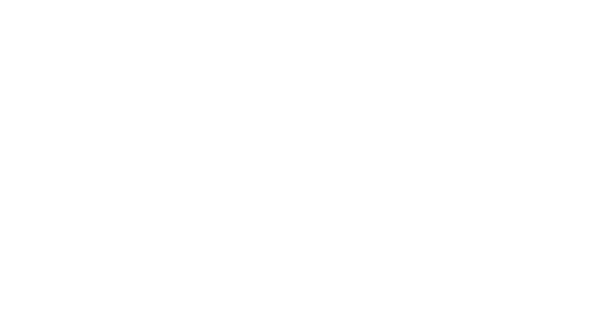

# **👋🏽 Hi, I’m Anup**
## I'm a **Data Scientist**, and an SME on CMS Medicaid and Medicare data, Healthcare Metrics, and Distributed Data Analysis on large-scale Linux clusters. 
### I code and work on my private Gitlab server, but this Github serves as my public-facing repository.

- 🎓Dual Degrees.
  - [BS] Mathematics
  - [BA] Economics
---
- 🚑 Healthcare Data Scientist.
  - Deep understanding of CMS Medicaid-MAX and Medicare-MedPAR
  - Admistrator of Secure Data Enclaves on HIPAA complient linux clusters
  - Pioneering national level healthcare analysis utilising the latest techniques in data science
---
- 💾 Deep Python + Linux acumen.
  - Multi-core distributed data analysis
  - GPU accelerated machine learning
  - Secure Linux based VMs + containers
  - open-source style collaborative programming
---

<!---
noopy-iot/noopy-iot is a ✨ special ✨ repository because its `README.md` (this file) appears on your GitHub profile.
You can click the Preview link to take a look at your changes.
--->
